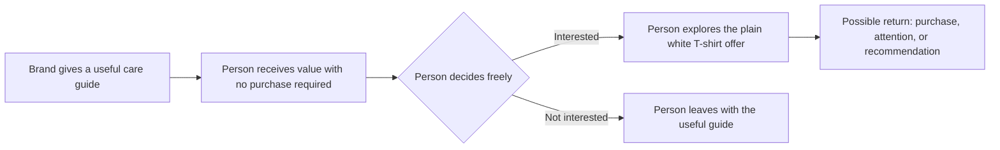

# Reciprocity

## What it is

Reciprocity is the social expectation that when someone gives us a benefit, we should respond in kind at some point. Robert Cialdini describes it as people giving back to those who have first given to them. The return does not have to match the original gift exactly: a favor might be repaid with help later, useful information with attention or a recommendation, or hospitality with an invitation.

This expectation helps people cooperate and maintain relationships. It can also influence decisions. A person who has received something useful may feel more open to a request from the giver. That response is a tendency, not a guarantee, and it does not mean every generous act is a calculated persuasion attempt.

Alvin Gouldner's sociological account helps clarify the idea: reciprocity is a norm that supports mutual exchange, but unequal power can turn exchange into exploitation. That distinction matters whenever a designer or organization gives something before making an ask.

## When to use it

Reciprocity can be appropriate when the benefit is real, relevant to the audience, and offered in a way that leaves people free to decline the next step. It is useful to educators, designers, businesses, nonprofits, community organizers, and anyone building a relationship in which people share resources and help one another.

It can serve several purposes: make an interaction more useful, demonstrate what an organization knows, reduce a barrier to getting started, invite a fair exchange, and build engagement or long-term trust. Providing genuine value first can give someone a good reason to pay attention. Trust comes from the quality and honesty of the benefit over time; it cannot be demanded as repayment.

## How it works in different settings

- **Branding and marketing:** A clothing brand publishes a genuinely useful care guide before showing its products. Readers may remember the brand, share the guide, or consider its offer because they received practical help first.
- **Websites:** A clear sizing guide, accessible template, or interactive tool solves a visitor's problem without requiring an email address. Visitors can choose to explore the paid offer afterward.
- **Social media:** A small business answers common questions with specific, reusable advice instead of making every post a sales pitch. Followers may reciprocate with attention or referrals, but they are not required to.
- **Education:** An instructor shares a study guide or explains a difficult concept before asking students to complete a survey. The resource helps students directly; the survey request remains optional and separate.
- **Networking:** Someone makes a relevant introduction or shares a useful article without immediately asking for a favor. The recipient may later return help, but there is no fixed debt or deadline.
- **Community building:** A neighborhood group provides a translation, tool library, or practical workshop before inviting residents to volunteer. People can benefit even if they cannot contribute time.

## How design can support an ethical exchange

Design helps people understand what they are receiving and what, if anything, is being asked in return. It should make the benefit easy to find and use, and the choice easy to understand.

- **Imagery:** Show the resource in use, such as a readable photo sequence demonstrating how to care for a shirt. Avoid imagery that exaggerates the benefit or implies a gift is conditional when it is not.
- **Color:** Use a consistent, legible palette to distinguish helpful content from a purchase prompt. Do not use alarm colors or visual urgency to disguise an optional request as mandatory.
- **Typography:** Make instructions, limits, and terms readable. A “download free guide” label should not hide an email signup requirement in tiny text.
- **Layout:** Put the promised value first and make the resource accessible before the ask. Place a clear, lower-pressure next step afterward, with an equally clear way to leave or decline.
- **Wording:** Be specific about what is free, what information is collected, and whether a follow-up is optional. “Here is the guide; the T-shirt is available if you want it” is clearer than “Claim your gift” followed by a purchase requirement.

## One plain white T-shirt, several ways to give value

The product remains the same plain white T-shirt in each example. What changes is the experience around it.

1. **Useful information first:** A brand posts a concise guide to washing white cotton without yellowing. The guide is useful even to someone who never buys the shirt. When the brand later presents its shirt, a reader may be more receptive because the brand has already helped with a real problem. That possible return of attention or consideration is reciprocity.
2. **A free resource:** The site offers a printable wardrobe-planning sheet with outfit combinations for basic pieces. It can be downloaded without an account, and the shirt appears as one optional item. The resource is the benefit; the shopper is free to use it without purchasing.
3. **Helpful styling advice:** A social post shows three ways to style the same white T-shirt for class, work, or a casual event, including options using clothes people may already own. The advice gives immediate value. A viewer may respond with a follow, share, or purchase, but the brand has not made the advice conditional on that response.
4. **A genuine added benefit:** At a community clothing-repair event, staff teach people to mend small snags and explain fabric care. The unchanged T-shirt is available afterward. Participants may feel goodwill toward the host and choose to shop, but the workshop is worthwhile on its own.

In each case, the shirt itself is unchanged. Reciprocity comes from the helpful exchange around the item, rather than a claim that the physical product has magically become more valuable.

## A reciprocity interaction

The return is possible, not owed. The interaction remains ethical when the person can take the benefit and decline the offer without penalty.

## Real-world examples

- **A restaurant mint with the bill:** Cialdini discusses restaurant studies in which a server's small gift, such as a mint, was associated with higher tips. The mint arrives before the tipping decision; diners may respond to the small benefit with a larger tip. It illustrates the mechanism, while also raising an ethical question if the gift is used as a covert lever rather than hospitality.
- **A colleague shares a useful reference:** If one colleague sends another a relevant source that saves research time, the recipient may later share expertise or return assistance. The connection is reciprocity because an initial benefit invites a future benefit in response, without requiring an identical trade.
- **An open-access community guide:** A local group publishes a free, accurate guide to finding food assistance, then invites people to share it or support the group if they are able. The practical information is the first benefit; a later contribution is voluntary. This is a community-minded use because access to the help does not depend on giving back.

## Ethical reciprocity and pressure

| Ethical reciprocity | Manipulation or coercion |
| --- | --- |
| Gives a useful benefit that stands on its own. | Offers something trivial, misleading, or unwanted mainly to create a sense of debt. |
| Makes any later request clear, proportionate, and optional. | Hides the request, escalates it, or implies the recipient owes compliance. |
| Explains conditions before someone gives data, time, or money. | Reveals conditions only after the person has accepted the “gift.” |
| Respects a no, a decline, or a decision not to reciprocate. | Uses guilt, embarrassment, repeated follow-ups, or social pressure to punish a no. |
| Gives people a real choice about taking the benefit. | Pushes unsolicited gifts onto people or makes them hard to refuse or return. |
| Considers unequal power, vulnerability, and the recipient's ability to repay. | Targets people who may feel unable to refuse or who cannot afford the implied return. |

The practical test is simple: would the benefit still be worth providing if the audience did not buy, subscribe, donate, or respond? If not, the “gift” may primarily be a pressure tactic. A gift can create obligation even when that is not the giver's intention, so good intentions alone do not settle the ethical question.

## When it may fail or be inappropriate

Reciprocity is not a reliable shortcut. A benefit that is irrelevant, low quality, difficult to use, or obviously self-serving may not build goodwill. People may also have different expectations about gifts and repayment depending on culture, relationship, setting, or personal circumstances.

It is inappropriate to use gifts to secure consent, silence criticism, influence a decision that should be impartial, or burden someone who has little power to refuse. In education, healthcare, fundraising, employment, and business purchasing, gifts can compromise judgment or create conflicts of interest. Avoid making essential information or services conditional on a purchase, personal data, or public endorsement. If people must register, disclose information, or attend a sales presentation to receive something, say so before they commit.

## Questions for a designer

- Is the benefit genuinely useful to the people I am addressing?
- Would I still offer it if nobody made a purchase or returned a favor?
- Can someone decline the next request without guilt, penalty, or repeated pressure?
- Are all conditions, data collection, and follow-up expectations visible up front?
- Is the requested return proportionate to what was given?
- Could the audience feel trapped because of age, finances, authority, urgency, or dependence on the service?
- Does the design make the free benefit and the optional offer equally clear?
- Can someone use the resource without endorsing the brand or sharing personal information?

## Sources

- Robert B. Cialdini, *Influence: The Psychology of Persuasion*, revised edition (Harper Business, 2021). Cialdini's foundational account of reciprocity and compliance.
- [Dr. Robert Cialdini's Seven Principles of Persuasion](https://www.influenceatwork.com/7-principles-of-persuasion/) — Influence at Work's overview of reciprocity and the restaurant mint studies.
- [Cialdini and Eberhardt on the Seven Principles of Influence](https://www.psychologicalscience.org/observer/universal-principles-of-influence) — Association for Psychological Science interview discussing reciprocation.
- [Alvin W. Gouldner, “The Norm of Reciprocity: A Preliminary Statement”](https://www.jstor.org/stable/2092623), *American Sociological Review* 25, no. 2 (1960): 161–178. A sociological analysis of reciprocity as a norm and its relationship to exchange and exploitation.
- [Vale, Schuster, and Greer, “Gifts to incentivise donations from young consumers: an ethical tension”](https://doi.org/10.1108/YC-11-2023-1908), *Young Consumers* 25, no. 6 (2024): 771–786. Research on how pre-giving incentives can create both gratitude and obligation.

## Navigation

[← Principles of Persuasion topic index](READ.ME.md)

## What You Should Remember

Reciprocity is the tendency to return benefits after receiving them. It can support cooperation and make persuasion more welcome when the first benefit is real, relevant, and freely given. Use it to help people, not to manufacture a debt: be transparent about the ask, keep refusal easy, and let the value stand on its own.
