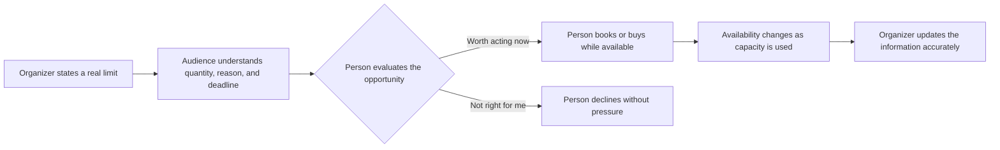

# Scarcity

## What it is

Scarcity is Cialdini's principle that people tend to value opportunities more when they seem less available. An item may be scarce because there are few units, a real deadline is approaching, access is restricted, or an experience can happen only under specific conditions. The principle can apply to a product, a seat, a service, a piece of information, or a chance to participate.

Limited access can make an opportunity stand out, prompt people to pay closer attention, and motivate them to act sooner. People may also infer that something is valuable, popular, distinctive, or difficult to replace because it is scarce. Those inferences can be mistaken: scarcity changes perception, but does not prove quality or usefulness.

Scarcity may be genuine, as when a venue has a fixed number of seats, or manufactured, as when a seller intentionally withholds available stock to make an item seem harder to get. Manufactured scarcity is not automatically deceptive if the limit is real, clearly explained, and not represented as something else. A false stock counter or a deadline that resets is deception.

## When to use it

Scarcity can be appropriate when a real limitation helps people make a timely, informed choice. It is useful to businesses explaining finite inventory, event organizers managing capacity, educators planning limited-seat workshops, and community groups allocating constrained resources. It can help audiences understand why an offer or experience may not remain available, or distinguish a genuinely limited edition from a standard product.

Use scarcity to communicate a constraint, not to manufacture anxiety. The audience should know what is limited, why it is limited, when the limit applies, and what happens after it ends. A real deadline can support planning; a vague countdown designed to trigger panic can undermine trust.

## How it works in different settings

- **Branding and marketing:** A maker explains that a numbered edition has a fixed quantity because it uses a one-time material batch. The stated limit clarifies the edition's actual availability and may make its distinctiveness more salient.
- **Websites:** A ticketing site shows the actual remaining capacity for a small event and updates the number as seats are booked. That information helps visitors decide whether to reserve a seat while the real capacity remains.
- **Social media:** A bookstore announces a one-day author event with a limited number of seats. The date and capacity tell followers why registration closes; a recurring “last chance” post after the event is full would mislead.
- **Education:** An instructor offers a hands-on studio session with twelve workstations. Stating the cap explains why registration is first come, first served and helps students decide promptly. It should not imply that course learning itself is available only to the fastest students.
- **Networking:** A professional group offers a small mentoring round because each mentor can support only a few participants. A published application deadline and capacity make the actual constraint visible; they do not guarantee acceptance or career results.
- **Community building:** A neighborhood garden has a fixed number of plots. Clear criteria, a waitlist, and the reason for the limit help residents understand how access is allocated and how to participate next season.

## How design can support ethical scarcity

Design should make a real limit legible without turning it into panic. The limit should be easy to verify and understand.

- **Imagery:** Show the actual setting or edition, such as the small venue or numbered run. Avoid stock images of empty shelves or crowds if they imply inventory or demand that is not true.
- **Color:** Use contrast to make dates and quantities easy to notice, while keeping the rest of the page calm and readable. Do not use flashing red alerts for a routine purchase decision.
- **Typography:** Set the quantity, deadline, and conditions in readable type. Do not shrink the important terms beneath an oversized “Hurry” headline.
- **Layout:** Put availability information beside the relevant offer, and explain the scope of the limit. An actual stock count should update accurately; an event deadline should include the time zone and registration terms.
- **Wording:** State the cause and endpoint plainly: “12 seats total; registration closes Friday at 5 p.m. ET or when full.” Avoid unsupported claims such as “everyone is buying,” “almost gone,” or “never again.”

## One plain white T-shirt, several scarcity frames

In each example, the physical product is the same plain white T-shirt. Only its availability or context changes.

1. **Limited production run:** A print studio orders a fixed quantity of 40 blank shirts because it is testing a small production batch. It labels the run and states that no additional units are currently planned. The finite batch is a real supply limit; buyers may value its distinct availability, but the shirt's material and function have not changed.
2. **Limited-time availability:** A campus store offers the shirt only during a clearly dated orientation-week pop-up because the pop-up closes afterward. The offer's access is limited by the real event dates, so a visitor may decide before the pop-up ends.
3. **Limited quantity:** A local artist's table has 15 shirts available at an outdoor market, with no restock during the event. An accurate count lets visitors understand the constraint. If more shirts are available in storage, claiming “only 15 exist” would falsely inflate scarcity.
4. **Exclusive edition:** A retailer reserves 25 units for a one-time campus event and explains that this allocation is event-only; the standard shirt is still sold elsewhere. The edition is exclusive only in the stated context, not a claim that the white T-shirt is globally unique.
5. **A real deadline:** A pre-order closes on a date because the printer needs final quantities to schedule production. The deadline is meaningful to the process, and the offer closes as promised. Reopening it repeatedly under the same “final hours” label would turn a true constraint into a false urgency cue.

These approaches change what someone knows about access to the same shirt. Scarcity may increase attention or motivation, but it cannot establish that the shirt is better quality or a better choice for a particular person.

## A scarcity interaction

When the limit and its status are transparent, scarcity can help someone decide. When the limit is fabricated or obscured, the same design becomes deception.

## Real-world examples

- **Concert tickets at a fixed-capacity venue:** A room can hold only a set number of people. As tickets are sold, the number of remaining seats decreases. This is scarcity because the resource (safe seats for a particular date and place) is genuinely finite; an accurate remaining-seat notice helps people understand availability.
- **A seasonal menu item:** A restaurant serves a dish only while a seasonal ingredient is available. Customers may pay closer attention because the dish will not be offered year-round. It demonstrates time- and supply-based scarcity if the ingredient and seasonal window actually determine availability.
- **Worchel, Lee, and Adewole's cookie study:** In a published experiment, participants rated cookies in scarce supply as more desirable than cookies in abundant supply; the context of the supply change also mattered. The study demonstrates how availability can affect perceived value even when the object itself is unchanged. It is a research example, not evidence that every limited offer will persuade every person.

## Ethical scarcity and deception

| Ethical scarcity | Manipulation or deception |
| --- | --- |
| Describes a real limit on stock, capacity, time, access, or production. | Invents a limit or suggests a constraint that does not exist. |
| Gives the reason, amount, and endpoint clearly enough to check. | Uses a vague “almost gone” claim, fake counter, or resetting countdown. |
| Updates availability when circumstances change. | Leaves stale scarcity messages active after stock is replenished or a deadline passes. |
| Makes room for informed comparison and a calm decision. | Uses alarming visuals or repeated pressure to prevent reflection. |
| Says exactly what is exclusive and where the limit applies. | Implies the standard product is globally rare when only one retailer's stock is limited. |
| Treats a waitlist, alternative, or future opportunity honestly. | Conceals accessible alternatives to make the current offer seem like the only chance. |

Genuine scarcity refers to an actual constraint. Manufactured scarcity refers to a limit deliberately created by restricting supply or access. In either case, the message is ethical only if it tells the truth about what was limited and why. A real limit can still be used coercively if the design exploits a vulnerable audience or makes an essential service seem arbitrarily scarce.

## When it may be ineffective or inappropriate

Scarcity can fail when the audience does not want the offer, distrusts the claim, or sees the limitation as irrelevant. It can also backfire: people who miss out may feel frustrated, switch to another provider, or distrust future messages. More pressure is not always more persuasion.

Scarcity is especially risky around essential goods and services, healthcare, education access, housing, emergency supplies, financial decisions, or audiences facing financial stress. Do not use invented limits, false popularity, or ticking clocks to push people into a costly or consequential decision. A truly limited resource should be allocated with fair, stated criteria, not opaque urgency that privileges people with more time, money, or faster internet.

## Questions for a designer

- What exactly is limited: quantity, time, access, capacity, or production?
- Is the limit real, current, and verifiable? Who is responsible for updating it?
- Why does the limit exist, and can I explain that reason accurately?
- Does “exclusive,” “limited,” or “last chance” mean what the audience will reasonably think it means?
- Is the deadline necessary for operations, or is it only there to create pressure?
- Will people have a fair way to access a waitlist, future offering, or suitable alternative?
- Could this message affect access to something essential or target people under financial or emotional pressure?
- Does the design give people enough information and time to make a considered choice?

## Sources

- Robert B. Cialdini, *Influence: The Psychology of Persuasion*, revised and expanded edition (Harper Business, 2021). Cialdini's account of scarcity and how limited availability can shape desire and choice.
- [Dr. Robert Cialdini's Seven Principles of Persuasion](https://www.influenceatwork.com/7-principles-of-persuasion/) — Influence At Work's overview describes scarcity and includes the Concorde example. The page also notes that it was created before the addition of Unity.
- [Worchel, Lee, and Adewole, “Effects of Supply and Demand on Ratings of Object Value”](https://doi.org/10.1037/0022-3514.32.5.906), *Journal of Personality and Social Psychology* 32, no. 5 (1975): 906–914. A classic experiment examining how cookie availability affected desirability and value ratings.
- [Biraglia, Usrey, and Ulqinaku, “The downside of scarcity: Scarcity appeals can trigger consumer anger and brand switching intentions”](https://onlinelibrary.wiley.com/doi/10.1002/mar.21489), *Psychology & Marketing* 38, no. 8 (2021): 1314–1322. Research describing a potential negative response when consumers cannot obtain a product advertised as scarce.
- [Shi et al., “Scarcity tactics in marketing: A meta-analysis of product scarcity effects on consumer purchase intentions”](https://www.sciencedirect.com/science/article/pii/S0022435922000434), *Journal of Retailing* (2022). A review of research on quantity, time, and other scarcity tactics.

## Navigation

[← Principles of Persuasion topic index](READ.ME.md)

## What You Should Remember

Scarcity can make an opportunity more noticeable and valuable because access is limited. Use it to explain a genuine constraint, with accurate details about its scope and endpoint. When availability is invented or urgency obscures a person's choices, scarcity becomes deception rather than clear communication.
