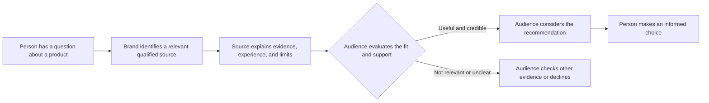

# Authority

## What it is

Authority is Cialdini's principle that people are more likely to listen to, trust, or follow someone they perceive as knowledgeable or legitimately qualified. An authority may have relevant expertise, professional training, experience, or a role that gives them responsibility in a particular setting. The principle describes a tendency in how people respond; it does not prove that the authority is correct or that a recommendation suits every person.

People often cannot independently verify every claim they encounter. When a decision calls for specialized knowledge, a qualified professional can help explain evidence, identify risks, and make a complicated choice easier to assess. Credentials, experience, reputation, and demonstrated knowledge can all contribute to credibility. Trustworthiness matters too: expertise in a subject does not guarantee honesty, impartiality, or good judgment.

Authority is strongest and most appropriate when it is relevant to the question, accurately represented, and supported by reasons or evidence the audience can examine. A textile engineer may be well placed to explain fabric construction; the same degree does not automatically make that person an expert on fashion trends or consumer finance.

## When to use it

Authority can help people find reliable guidance, understand a technical subject, and judge whether a recommendation has a sound basis. It is useful for educators, qualified professionals, organizations with relevant experience, public information services, and brands that can substantiate what they say. It can also help a new audience understand who created a resource and why that person is qualified to speak about its topic.

Use it to support informed choice rather than demand obedience. Explain the person's relevant qualifications, show the basis for important claims, and make limits or uncertainty visible. A credible expert welcomes reasonable questions and knows when a subject falls outside their expertise.

## How it works in different settings

- **Branding and marketing:** A clothing label explains that a named textile specialist reviewed its fabric-care instructions, states the specialist's relevant experience, and links to the underlying care guidance. The specialist's fit for the topic gives the advice more context than a generic “expert approved” badge.
- **Websites:** A health information page lists the author and clinical reviewer, their relevant qualifications, the review date, and links to evidence. Visitors can judge who is responsible for the information and whether the expertise matches the topic.
- **Social media:** A tailor demonstrates how fabric weight affects drape, identifies themselves accurately, and shows the method. The explanation and visible work provide evidence of skill; a professional-looking profile alone would not establish it.
- **Education:** An instructor explains a subject using examples, cites sources, and distinguishes settled findings from open questions. Students have reason to rely on the instructor's knowledge while still being invited to think critically.
- **Networking:** A designer shares a portfolio and describes their role in a project before offering advice on production. Relevant work lets a potential collaborator assess the designer's experience instead of relying on a grand title.
- **Community building:** A local repair group invites an experienced seamstress to teach basic mending and makes clear what the session covers. Participants can see why the teacher is suited to that practical topic and what the lesson does not claim to cover.

## How design can support ethical authority

Visual design can make real qualifications and evidence easier to find. It cannot create expertise by itself.

- **Imagery:** Show the actual person doing relevant work, such as examining a fabric sample, and identify them accurately. A staged laboratory coat or stock photo can imply qualifications that the person does not have.
- **Color:** Use a consistent, accessible palette to organize credentials, evidence, and explanations. A prestigious-looking dark palette or gold accent is a style choice, not proof of competence.
- **Typography:** Give names, qualifications, dates, and citations readable type. Avoid oversized honorifics that make a title dominate the evidence.
- **Layout:** Place a concise author or reviewer biography near the claims they support, with links to sources and clear disclosures of sponsorship or conflicts. Keep the qualifications relevant and easy to verify.
- **Wording:** Use precise, bounded claims such as “A textile engineer with 10 years of knit-fabric testing reviewed this explanation.” Avoid uncheckable phrases such as “the world's leading expert” or “scientifically proven” without appropriate evidence.

## One plain white T-shirt, several authority frames

The T-shirt stays physically identical in every example. Only the information and people around it change how an audience may interpret it.

1. **A qualified clothing designer's endorsement:** A designer with documented apparel design experience explains that the shirt's simple cut makes it easy to layer. This offers relevant professional judgment about styling. It does not prove the shirt is durable, ethically made, or flattering for every wearer; the designer's relationship to the seller should be disclosed.
2. **Textile expertise:** A textile specialist explains what the listed fiber content and fabric weight mean for feel and care, while noting that the shirt itself has not been independently tested if that is the case. The audience can use relevant technical knowledge to understand the material without mistaking an explanation for a quality certification.
3. **Documented specifications:** The product page gives the fiber composition, measured garment dimensions, and care instructions, and explains how the measurements were taken. These specific, checkable details support the brand's authority by showing knowledge of the item. The facts do not establish performance claims that have not been measured.
4. **Professional styling advice:** A stylist demonstrates how the same shirt works under a jacket and with different trousers, describing the choices as suggestions rather than rules. Relevant experience makes the guidance useful; it does not turn taste into objective fact.
5. **An established brand's experience:** A clothing company with a verifiable history of making basics explains its sizing approach and shows how it checks fit across sizes. Past work can help audiences assess its capability, but brand longevity alone does not guarantee this particular shirt's quality.

In each case, authority comes from relevant expertise, transparent evidence, or a track record. The unchanged shirt has not gained new physical qualities simply because a qualified person or familiar brand discusses it.

## An authority interaction

The expert's role helps frame the decision; the audience still evaluates the claim and chooses what to do.

## Real-world examples

- **A clinician reviewing a patient information page:** A hospital can identify a qualified clinician who reviewed an explanation of a medical procedure, include the review date, and link to supporting evidence. This demonstrates authority because the reviewer has relevant professional training and responsibility for the content. The qualification does not remove the reader's need for advice suited to their own circumstances.
- **Cialdini's expert introduction example:** Influence At Work describes an experiment in which introducing a person as an expert before they spoke increased appointments and signed contracts. This illustrates that people may respond differently when relevant expertise is established before a request. It is a reported example from Cialdini's organization, not a guarantee that introductions will produce the same result in every setting.
- **A fabric-care label:** A garment maker that provides specific fiber content and practical care instructions gives customers information they can use to make decisions and maintain the product. The details demonstrate knowledge only to the extent that they are accurate and substantiated; a label or technical vocabulary alone is not proof.
- **Milgram's obedience experiments as a caution:** Stanley Milgram's research examined how people responded to an experimenter's instructions in a controlled setting. It is not a product endorsement example, but it shows why commands associated with authority deserve ethical scrutiny: perceived authority can lead people to comply even when they feel uneasy. It should not be taken to mean all professional guidance is harmful or that the study represents every real-world authority relationship.

## Legitimate and misleading authority

| Legitimate authority | Manufactured or misleading authority |
| --- | --- |
| Shows relevant qualifications, experience, or responsibility that can be checked. | Uses impressive titles, uniforms, badges, or jargon without relevant competence. |
| Connects the expert's knowledge to the specific question being answered. | Treats expertise in one field as proof about unrelated claims. |
| Supports important claims with evidence, examples, or a clear explanation. | Relies on confident delivery or status symbols in place of support. |
| Identifies uncertainty, limits, commercial ties, and conflicts of interest. | Hides sponsorship, invents endorsements, or implies independent review that did not occur. |
| Invites questions and leaves people free to compare advice or decline. | Uses intimidation, urgency, or rank to discourage questions and secure obedience. |
| Separates demonstrated expertise from popularity or prestige. | Assumes fame, wealth, institutional status, or a large following proves correctness. |

Legitimate authority differs from intimidation because it gives people a reason to consider guidance, not a threat for refusing it. It differs from status signaling because the basis for trust is relevant knowledge and conduct, not appearance alone. It differs from blind obedience because people retain the ability to question, compare, and decide.

## When it may be ineffective or inappropriate

Authority may be ineffective when the speaker's expertise is unrelated, the audience distrusts the source, the claim lacks evidence, or the advice ignores the audience's circumstances. Credentials can establish training, but they do not guarantee accuracy in every case. A newcomer with direct, relevant experience may know more about a particular practical problem than a famous person with no experience of it.

Authority is inappropriate when it is used to silence questions, substitute a title for evidence, pressure a dependent audience, or imply that a recommendation is mandatory when it is not. In medicine, law, finance, education, and public safety, misleading authority can cause serious harm. Avoid exaggerating qualifications, expertise, endorsements, awards, or accomplishments. A fabricated credential or an undisclosed paid endorsement can lead people to place confidence where it is not warranted and can damage trust in the organization and the field.

## Questions for a designer

- What specific question is this authority helping the audience answer?
- Is the person's knowledge relevant to that question, and can the audience verify the claimed qualifications?
- What evidence supports the recommendation, beyond the person's title or appearance?
- Does the expert have a financial, professional, or personal interest that should be disclosed?
- Are any endorsement, review, credential, award, or performance claims accurate and current?
- Have we made uncertainty and the limits of the advice clear?
- Does the design invite evaluation, or does it use status, fear, or intimidating language to shut down questions?
- Can a person compare other sources or decline without penalty?
- Does the visual presentation make the expert seem more qualified than they are?
- Would I still consider this a responsible message if the audience checked the claim independently?

## Sources

- Robert B. Cialdini, *Influence: The Psychology of Persuasion*, revised and expanded edition (Harper Business, 2021). Cialdini's account of how perceived expertise and authority affect persuasion.
- [Dr. Robert Cialdini's Seven Principles of Persuasion](https://www.influenceatwork.com/7-principles-of-persuasion/) — Influence At Work's overview of authority, credibility, and the expert introduction example.
- [Hovland and Weiss, “The Influence of Source Credibility on Communication Effectiveness”](https://academic.oup.com/poq/article-abstract/15/4/635/1923117), *Public Opinion Quarterly* 15, no. 4 (1951): 635–650. Foundational research on how source credibility can affect responses to communication.
- [Milgram, “Some Conditions of Obedience and Disobedience to Authority”](https://doi.org/10.1177/001872676501800105), *Human Relations* 18, no. 1 (1965): 57–76. Research relevant to the ethical distinction between informed trust and obedience to perceived authority.

## Navigation

[← Principles of Persuasion topic index](READ.ME.md)

## What You Should Remember

Authority can help people evaluate advice when the source has relevant knowledge, communicates honestly, and supports claims with evidence. Credentials and confident design can make expertise visible, but they do not create it. Show what qualifies a source, disclose limits and interests, and leave the audience room to think and choose.
