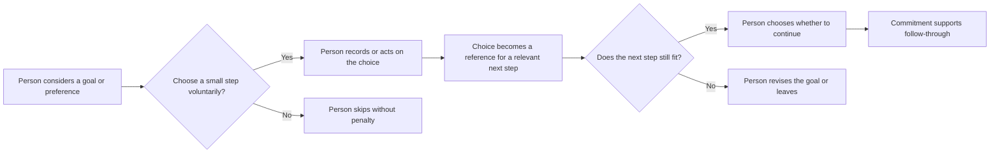

# Commitment and Consistency

## What it is

Commitment and Consistency is Robert Cialdini's principle that people often prefer to act in ways that fit what they have previously said, chosen, or done. A commitment is a decision, statement, or action a person regards as their own; consistency is the tendency to align later choices with it. The earlier commitment can become a reference point: “I chose this because it fits my priorities, so what is the next step that fits too?”

Consistency can help people carry intentions into action. It can also make people defend an old decision after their circumstances or preferences have changed. It describes a tendency, not a rule: people are not automatons, and a previous yes does not mean a person will or should say yes again.

## Why it can influence later behavior

People often want their actions, beliefs, statements, and decisions to form a coherent story. Coherence helps us understand ourselves and be understood by others; it can make plans easier to remember and follow through on. If someone freely says “I want a wardrobe with fewer, more versatile pieces,” later choices may be evaluated against that preference. A related next step can feel easier to recognize because the person has already clarified what matters to them.

The commitment does not have to be a contract. A person may select an option, write down a goal, sign a card, tell a friend, or take a small action. Those forms can make an intention more concrete. Cialdini highlights commitments that are voluntary, active, and sometimes public or written: they tend to give a person a clearer sense that the choice was theirs and something they can refer back to. These features can strengthen follow-through, but they do not guarantee it, and public visibility can also create pressure.

Previous decisions can act as reference points without binding someone. A person who picked a simple style may use that selection to compare later designs. Someone who joined a clothing-care newsletter may pay more attention to care information. The earlier decision provides context, not proof that a product is right or an obligation to buy it.

## When to use it

Commitment and Consistency is appropriate when the commitment helps a person express a real preference, make a plan they want, or take a useful step toward their own goal. It can serve educators helping students turn intentions into study plans, community organizers inviting residents to choose a manageable contribution, and brands helping customers find options that fit stated needs. A good use makes the purpose clear, asks for an appropriately small choice, and leaves the next decision open.

Small steps can create a path toward larger goals when each step is useful on its own and the person chooses whether to continue. A visitor might first select a fit preference, then view a guide to sizing, and later decide whether to browse products. The path is clearer because each action responds to the visitor's stated interest. It becomes pressure if the small action secretly enrolls someone, triggers repeated sales requests, or is treated as consent to a bigger request.

## How it works in different settings

- **Branding and marketing:** A clothing brand asks shoppers whether they prefer a minimalist, colorful, or graphic style, then shows relevant examples. The selection is a voluntary expression of taste that can guide browsing; it is not a pledge to buy.
- **Websites:** A visitor chooses a goal such as “learn how to measure a shirt” and receives a measurement guide. The site can remember that preference if it clearly explains the feature and offers an easy way to change or clear it.
- **Social media:** A creator invites followers to share one clothing-care habit they want to keep, such as air-drying a favorite shirt. Writing the intention can help a person make it concrete, while comments should remain optional and private participation should still be possible.
- **Education:** Students who choose and write a realistic weekly study goal can use it as a reference when planning their schedule. The goal belongs to the student and can be revised if it proves unrealistic.
- **Networking:** A student says they want to learn more about sustainable apparel design and chooses one next step, such as asking a designer about their work. The stated interest makes the next conversation relevant without obligating either person to a longer relationship.
- **Community building:** A clothing-swap group asks each participant to choose one manageable role, such as sorting donations for 20 minutes or sharing the event notice. People can contribute in a way they selected, and can decline or change roles.

## How design can support an ethical commitment

Design should help people understand their choices and remember intentions they actually want to pursue. It should not make a commitment seem larger, more public, or harder to reverse than it is.

- **Imagery:** Show real ways the item can fit a person's stated use, such as the same white shirt layered under a jacket or worn casually. Avoid before-and-after imagery that implies a style selection proves something about someone's identity or worth.
- **Color:** Use calm, consistent visual cues to mark a selected preference or saved goal. Do not make the “continue” option bright and prominent while hiding “edit,” “skip,” or “remove.”
- **Typography:** Make the words around a commitment readable. A checkbox should say what will happen, such as “Email me occasional care tips,” rather than “I’m in” when that phrase conceals marketing consent.
- **Layout:** Let people review their selection and its consequences before saving it. Make editing, unsubscribing, and leaving the flow easy to find; do not add friction to changing one's mind.
- **Wording:** Ask for a specific, limited choice: “Which fit would you like to compare?” is clearer than “Prove you care about sustainability by choosing a responsible brand.” Avoid labeling a person as a “committed customer” after one click.

## One plain white T-shirt, several commitment frames

The physical product is the same plain white T-shirt throughout. The presentation invites different voluntary choices, which can influence how people interpret or interact with it.

1. **Identify a preference:** A page asks, “Do you usually prefer a relaxed or close fit?” The visitor selects relaxed and sees the shirt's dimensions and styling examples for that fit. This demonstrates the principle because the visitor's own stated preference becomes a reference for evaluating the unchanged shirt. They can change the selection or leave without buying.
2. **Select a style:** A lookbook asks visitors to choose “minimal,” “layered,” or “sporty” styling. A visitor picks layered; the next page shows the same shirt under a cardigan. The choice makes a related presentation more personally relevant, but it is only a style selection, not a commitment to purchase.
3. **Sign up for useful information:** A visitor opts in to receive a short series of shirt-care tips by email, with frequency and unsubscribe details visible. Having actively chosen the information, they may pay closer attention to the same shirt's care instructions. The opt-in reflects an interest and can guide later interaction; it must not be treated as consent to unrelated marketing.
4. **Create a personal goal:** Someone writes, “I want to build three outfits from clothes I already own.” A styling tool includes the plain white T-shirt as one possible basic and suggests combinations using existing clothes. The written goal becomes a reference for comparing options. The tool should welcome a revised goal and should not suggest a purchase is required to meet it.
5. **Make a small, optional commitment:** A campus pop-up asks, “Would you like to try one outfit combination with this shirt?” The visitor chooses to try it, then decides whether the shirt suits them. The first action can make the product easier to assess because it follows the visitor's own choice; it does not obligate them to buy or continue.

In all five examples, the shirt's fabric, fit, and quality stay the same. What changes is the visitor's chosen frame or next action. Ethical design uses that information to make exploration more relevant, while keeping a clear exit and respecting a changed preference.

## A commitment interaction

The initial choice can make the next step feel coherent. It should remain a choice at every stage, and the person should be able to revise or stop.

## Real-world examples

- **The “Drive Safely” sign studies:** In research discussed by Cialdini, homeowners who had first agreed to display a small card supporting safe driving were more likely later to agree to a much larger yard sign than homeowners who had not made that initial commitment. The small public action and larger request concerned the same cause; the first choice offered a reference point for the later one. This is an example of a possible consistency effect, not a dependable percentage for every campaign or audience.
- **Patients writing appointment details:** Influence At Work describes a health-center study where asking patients to write down their own appointment details reduced missed appointments. Writing the date made the plan active and concrete, so patients could refer to a record they had created. This is a practical follow-through example; it does not mean every written commitment succeeds or that reminders and access barriers do not matter.
- **Freedman and Fraser's foot-in-the-door research:** Their 1966 experiments tested whether agreeing to a small request could increase compliance with a later, larger request. This shows how a first act can influence a later one, but it also raises an ethical distinction: an organization should not use a harmless-looking request as a concealed route to an unrelated or burdensome demand.
- **A student's self-set study plan:** A student writes down two study periods they chose for the week and checks in privately at week's end. The written plan gives them a reference point for action they already wanted to take. If work, health, or other responsibilities change, revising the plan is sensible rather than a failure of character.

## Ethical commitment and consistency versus manipulation

| Ethical commitment and consistency | Manipulation or pressure |
| --- | --- |
| Asks for a clear, relevant, voluntary choice. | Makes a choice seem trivial while hiding its later consequences. |
| Uses the person's stated goal to offer a useful next step. | Exploits a prior click or statement to push an unrelated or larger request. |
| Explains what will be saved, shared, or sent before the person agrees. | Enrolls people in marketing, public posts, or recurring payments through ambiguous wording. |
| Lets people edit, withdraw, unsubscribe, or stop without shame or penalty. | Treats changing one's mind as weakness, hypocrisy, or a broken promise. |
| Makes public commitments optional and offers a private alternative. | Uses peer visibility, leaderboards, or public pledges to embarrass people into compliance. |
| Keeps each step proportionate and valuable in itself. | Escalates requests until the person feels trapped by earlier effort or expense. |
| Treats old commitments as context, not permanent consent. | Uses sunk costs or past decisions to tell someone they must continue. |

## When it may be ineffective, inappropriate, or unethical

A prior commitment may not influence behavior when the person no longer cares about the goal, the next request is unrelated, circumstances have changed, or the commitment was never meaningful to them. A small first step does not guarantee a larger one; people may also react against feeling steered. Consistency can be especially inappropriate when a decision has serious financial, health, educational, legal, or personal consequences.

Do not exploit a previous purchase, donation, disclosure, or public statement to push someone to spend more, reveal more, or remain in a relationship they want to leave. Past investment is not a reason to continue if the choice no longer serves the person. Avoid public commitment devices for sensitive goals or for audiences with limited ability to refuse, such as students responding to a teacher, employees responding to a supervisor, or people seeking an essential service. Make opting out ordinary, private, and consequence-free.

Designers and communicators should respect the ability to change one's mind because consistency is not always wisdom. New information, changing needs, mistakes, and reflection can all justify a different choice. A trustworthy interaction supports follow-through when wanted and makes reconsideration possible when needed.

## Questions for a designer

- What does the person actually commit to, and have I described it plainly?
- Is this choice voluntary, relevant to the person's own goal, and useful on its own?
- Does the person know whether the choice will be stored, shared, or used for marketing?
- Is any later request clearly related and proportionate to the first step?
- Can the person skip, revise, withdraw, unsubscribe, or stop just as easily as they began?
- Does the design make a public commitment optional and provide a private alternative?
- Am I using a past decision as helpful context or as leverage to overcome a current no?
- Could power, age, financial stress, health, or dependence make refusal difficult?
- If a person's priorities change, does the experience let them act on that change without blame?
- Would I consider this interaction fair if the person never bought or continued?

## Sources

- Robert B. Cialdini, *Influence: The Psychology of Persuasion*, revised and expanded edition (Harper Business, 2021). Cialdini's account of commitment and consistency as an influence principle.
- [Dr. Robert Cialdini's Seven Principles of Persuasion](https://www.influenceatwork.com/7-principles-of-persuasion/) — Influence At Work's explanation of voluntary, active, public, and written commitments, the safe-driving card example, and appointment cards.
- [Freedman and Fraser, “Compliance without Pressure: The Foot-in-the-Door Technique”](https://pubmed.ncbi.nlm.nih.gov/5969145/), *Journal of Personality and Social Psychology* 4, no. 2 (1966): 195–202. Original research testing whether agreement to a small request affects response to a later larger request.
- [Locke, Latham, and Erez, “The Determinants of Goal Commitment”](https://doi.org/10.5465/amr.1988.4306771), *Academy of Management Review* 13, no. 1 (1988): 23–39. Academic discussion of commitment to goals and factors associated with it.
- [“4.3 Changing Attitudes by Changing Behavior,” Principles of Social Psychology](https://opentext.uoregon.edu/socialpsychology/chapter/changing-attitudes-by-changing-behavior/), University of Oregon open textbook. An accessible account of commitment, consistency, and self-perception.
- [Cialdini and Eberhardt on the Seven Principles of Influence](https://www.psychologicalscience.org/observer/universal-principles-of-influence), Association for Psychological Science. Interview discussing Cialdini's principles, including consistency with what people have said or done.

## Navigation

[← Principles of Persuasion topic index](READ.ME.md)

## What You Should Remember

Commitment and Consistency describes how a voluntary earlier choice can guide a later one. Help people make meaningful commitments to goals they actually hold, and use those commitments to offer relevant next steps. Never turn a past yes into permanent consent: people must be free to revise, decline, or leave.
