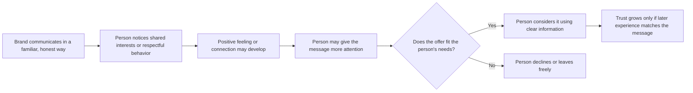

# Liking

## What it is

Liking is Robert Cialdini's principle that people tend to be more receptive to requests and messages from people they like. In everyday life, liking can mean warmth, respect, enjoyment, or a sense of connection. In persuasion, those positive feelings can influence whether someone pays attention, listens openly, or considers a request. They do not prove that the request is sound, and they do not guarantee agreement.

Cialdini highlights similarity, compliments, and cooperation as factors that can contribute to liking. Familiarity and positive associations can matter too: a recognizable voice, image, or shared experience may feel comfortable. These factors are tendencies, not rules. People differ, repeated exposure can become irritating, and perceived similarity does not always create trust. Liking is most constructive when it grows from an honest relationship and accompanies clear, useful communication.

A brand or organization is not literally a person, but people may respond to its voice, behavior, representatives, and community as social signals. A considerate brand can feel relatable; a polished campaign cannot substitute for fair treatment or a useful product.

## When to use it

Liking is appropriate when a communicator wants to make an interaction more human, approachable, and relevant while respecting the audience's judgment. It can help teachers invite participation, community groups welcome new members, businesses explain a service, and designers make information easier to engage with. It can support attention and trust when the communication is consistent with how the organization actually behaves.

Liking can serve a practical purpose: make a message feel easier to approach, build a relationship over time, encourage a conversation, or help someone consider an option in a low-pressure way. It should not be used to bypass a person's questions or make a weak offer seem trustworthy. A likable messenger can earn a hearing; reasons, evidence, and the person's needs should shape the decision.

## How it works in different settings

- **Branding and marketing:** A small apparel brand shares honest stories about how it designs everyday basics and invites customers to discuss what they want from a T-shirt. People who recognize their own priorities may feel a connection to the brand's voice.
- **Websites:** A student services site uses plain language, welcoming photographs of actual students, and a visible way to contact a person. Visitors can feel more at ease asking for help because the site seems made for people like them and signals that questions are welcome.
- **Social media:** A local bookstore responds thoughtfully to comments and shares staff members' genuine reading recommendations. Followers can become familiar with the people behind the store through repeated, helpful interaction.
- **Education:** An instructor learns students' names, listens to their questions, and uses examples connected to their course interests. Students may be more willing to participate because they feel respected and see a shared learning purpose.
- **Networking:** Two students discover they both work on campus and are interested in accessible design. That real common ground gives them an easy opening for conversation; asking questions and listening can build a connection beyond the initial similarity.
- **Community building:** A neighborhood group works alongside residents on a cleanup they chose together. Cooperation toward a shared goal can build goodwill because members experience the group as a partner, not simply as an organization asking for support.

## How design can support ethical Liking

Visual and verbal choices can make a message feel familiar and welcoming, but they should reflect the people, values, and experience that are actually present.

- **Imagery:** Show real settings, people, or activities relevant to the audience, with appropriate permission. A campus clothing brand might show students wearing everyday basics in familiar campus spaces. Avoid using a narrow stereotype as shorthand for an entire audience.
- **Color:** Choose a palette that feels coherent with the brand and legible to its audience. A warm, calm palette may feel inviting for a community resource, but color alone cannot create care or belonging.
- **Typography:** Use readable type with a tone suited to the context. A friendly rounded display face may make a casual clothing page feel approachable; body copy still needs clear, accessible text.
- **Layout:** Give people room to explore, learn about the organization, and find contact or help information. A page that hides prices or makes it hard to reach a person undermines its welcoming appearance.
- **Wording:** Be direct, respectful, and specific. “Here is how this shirt fits and how we made it” invites an informed choice. “You and we are basically best friends” claims an intimacy the brand has not earned.

## One plain white T-shirt, several ways to build Liking

The physical product is the same plain white T-shirt in every example. Only the way the brand presents and discusses it changes.

1. **Relatable personality:** A small brand uses a warm, practical voice and admits that it designed the shirt as an uncomplicated everyday layer. The straightforward personality may feel familiar to people who share that preference; the shirt itself has not changed.
2. **Shared interests:** The brand publishes a styling post for people who like simple wardrobes, showing the shirt with items people may already own. Someone with that interest may feel understood because the example responds to a real preference rather than pretending the brand has a personal bond with each viewer.
3. **Familiar imagery:** The site photographs the shirt in an ordinary dorm laundry room and on a campus walk, not in an unrelated luxury setting. Students who recognize those environments may find the presentation easier to relate to.
4. **Authentic storytelling:** The maker explains why it chose a plain white shirt for a first small collection, including what it knows and does not know about the garment's sourcing. Specific, verifiable details can make the maker seem more human and credible; a sentimental story without evidence would not.
5. **Community connection:** The brand co-hosts a campus clothing-repair table with a student group and invites feedback on care instructions. The shared activity can build positive feelings through cooperation, while the shirt remains an optional product rather than the price of joining.
6. **Approachable language:** A product page says, “A plain white T-shirt for days when you want to keep getting dressed simple. Check the size chart, and ask us if you need help.” The conversational wording makes questions welcome and gives useful information without assuming everyone will like the shirt.

These examples can make the same object feel more familiar or connected to an audience. They cannot make an unsuitable fit, price, or product quality suitable by changing the story around it.

## A Liking interaction

The pathway is possible, not automatic. Liking may make communication easier, while a fair decision still depends on the offer and the person's needs.

## Real-world examples

- **A clothing shop remembers a returning customer's stated fit preference:** If a staff member uses that information to point out relevant sizes and asks whether it is still helpful, the customer may feel recognized and understood. This demonstrates Liking through respectful familiarity and attentive service. It becomes intrusive if the shop uses private information without permission or assumes the preference never changes.
- **A student organization works with new members on an event:** Members who plan the event together can come to appreciate one another through cooperation toward a shared goal. The connection arises from a real joint activity, which illustrates how cooperation can contribute to liking.
- **A teacher gives specific, sincere feedback:** “Your example makes the difference between these two ideas clear” recognizes an actual contribution. The student may feel respected and become more comfortable participating. This demonstrates the role of a genuine compliment; generic praise used to obtain compliance would not carry the same honest basis.

## Genuine Liking versus manufactured rapport

| Genuine Liking | Manipulation or manufactured rapport |
| --- | --- |
| Points to a real shared interest, experience, or goal. | Pretends to share hobbies, background, or values to win confidence. |
| Gives compliments that are specific, deserved, and freely expressed. | Uses exaggerated flattery to make someone feel obligated or special. |
| Builds familiarity through useful, respectful interactions over time. | Creates artificial intimacy or repeatedly inserts a brand into personal spaces. |
| Works with people toward a goal that matters to them too. | Calls a sales funnel a community while members receive no meaningful voice or benefit. |
| Uses audience research to make communication relevant and inclusive. | Stereotypes an audience or imitates its language as a costume. |
| Shares accurate stories and clearly identifies sponsored content. | Invents personal stories, endorsements, or grassroots support. |
| Accepts questions, disagreement, and refusal. | Treats a refusal as betrayal of a supposed friendship. |
| Uses personal information with notice, consent, and a clear purpose. | Mines private information to simulate shared experience or target vulnerability. |

## When Liking may fail or be inappropriate

Liking is not a reliable shortcut to agreement. The audience may not share the communicator's preferences, may dislike a familiar style, or may focus on a product's price, accessibility, evidence, or performance instead. Too much repetition can irritate people; forced friendliness can feel less trustworthy than a direct, professional tone. Similarity can also be overestimated: two people may share one interest and disagree about everything else.

Liking is inappropriate when it obscures material facts, pressures someone to comply, or substitutes personal warmth for the competence and impartiality a decision requires. In a classroom, workplace, medical setting, or public service, power differences can make friendliness feel like an expectation. Do not use compliments, familiarity, or community membership to make people feel they owe a purchase, disclosure, endorsement, or vote.

Designers and communicators should avoid fake compliments, manufactured relationships, deceptive similarity, and the use of personal data to create artificial rapport. These tactics can make people feel watched or tricked, especially when details from a private profile or sensitive context are used to imply a personal connection. Collect only information needed for a clear purpose, explain how it will be used, and make personalization easy to decline. Build connection through honest behavior, listening, and shared work instead.

## Questions for a designer

- What actual shared interest, need, or goal does this message address?
- Is any claimed common ground true, specific, and relevant?
- Are compliments based on something real, and are they separate from a request?
- Does the audience have a meaningful chance to respond, disagree, or shape the work?
- Am I using personal information in a way the person expects and has agreed to?
- Does the visual style welcome a broad audience, or rely on a stereotype?
- Would the message still be honest if the person did not like the brand?
- Can someone decline without being made to feel rude, disloyal, or excluded?
- Does the product or proposal deserve consideration on its own merits?
- Will the organization's real behavior support the friendly impression this design creates?

## Sources

- Robert B. Cialdini, *Influence: The Psychology of Persuasion*, revised and expanded edition (Harper Business, 2021). Cialdini's discussion of liking as a principle of influence.
- [Dr. Robert Cialdini's Seven Principles of Persuasion](https://www.influenceatwork.com/7-principles-of-persuasion/) — Influence At Work's overview of similarity, compliments, cooperation, and liking in negotiation.
- [Robert B. Cialdini and Jennifer L. Eberhardt on the Seven Principles of Influence](https://www.psychologicalscience.org/observer/universal-principles-of-influence) — Association for Psychological Science interview discussing genuine similarity and praise.
- [Abbasi, Billsberry, and Todres, “Empirical studies of the ‘similarity leads to attraction’ hypothesis in workplace interactions: a systematic review”](https://link.springer.com/article/10.1007/s11301-022-00313-5), *Management Review Quarterly* 74 (2024): 661–709. Review of research on similarity and interpersonal attraction in workplace settings.
- [Montoya and Horton, “A meta-analytic investigation of the processes underlying the similarity-attraction effect”](https://journals.sagepub.com/doi/10.1177/0265407512452989), *Journal of Social and Personal Relationships* 30, no. 1 (2013): 64–94. Meta-analysis examining factors that affect similarity's relationship to interpersonal attraction.

## Navigation

[← Principles of Persuasion topic index](READ.ME.md)

## What You Should Remember

Liking is the tendency to be more receptive to people and messages toward which we feel positively. Similarity, familiarity, sincere compliments, cooperation, and positive associations can help connection grow, but none should be faked or used to pressure people. Make communication welcoming and relatable, then let people judge the message and decide freely.

