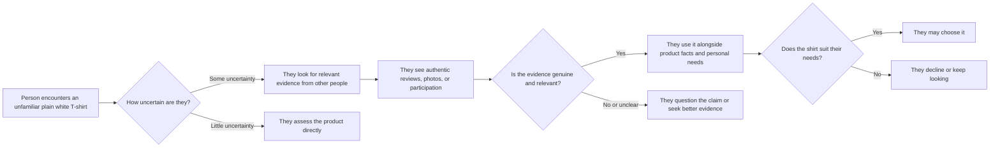

# Social Proof

## What it is

Social Proof is Robert Cialdini's principle that people often use other people's actions, opinions, and experiences as clues about what to do. When a situation is unfamiliar or ambiguous, seeing how others responded can help us decide what seems sensible. Cialdini emphasizes that this influence can be especially strong when the people we observe seem similar to us or relevant to our situation.

Social Proof is evidence about other people's behavior or experience, not proof that an offering is good, safe, or right for everyone. A rating, recommendation, or busy community can help someone form a judgment, but the evidence has limits: who contributed it, what they experienced, and whether it represents the wider group all matter.

The evidence may be direct, such as watching people participate in a demonstration, or reported, such as reading customer reviews. Reviews, testimonials, ratings, recommendations, user numbers, community participation, demonstrations, and observable choices can all act as Social Proof when they show what other people actually think or do. A testimonial also communicates a person's stated experience; it should not be confused with independent verification of every claim.

## When to use it

Social Proof can be appropriate when people have real, relevant evidence to share and the audience needs help understanding how an option works in practice. It is useful for designers, educators, businesses, nonprofits, community groups, and individuals who want to explain the experiences of a real user group, show participation, or make a new activity easier to evaluate.

It can answer practical questions: Have people tried this? What did they find useful? How does it work for people in circumstances like mine? Who is already participating? Social Proof can reduce uncertainty, invite participation, and help an audience compare an offer with lived experience. It cannot replace product information, expert assessment, or the audience's own judgment.

## How it works in different settings

- **Branding and marketing:** An apparel brand shares voluntary, authentic customer feedback about fit and fabric feel, including a range of views. Shoppers can see how actual wearers experienced the shirt rather than relying only on the brand's claims.
- **Websites:** A course page reports the current number of enrolled students and explains the date and method of the count. That number can signal participation; it does not guarantee course quality or outcomes.
- **Social media:** A community organization shows consenting participants at a real cleanup and shares the event's actual attendance. Viewers can see that people took part and may understand what joining looks like.
- **Education:** A teacher shares anonymous examples of how students solved a practice problem, with permission and without implying every student chose the same method. Students can learn from peers' approaches and see that attempting the task is normal.
- **Networking:** A student asks a recent graduate from the same program about their experience finding an internship. That relevant first-hand account helps the student understand one person's path, while leaving room for different outcomes.
- **Community building:** A neighborhood group posts a map of current volunteer projects and participant-submitted notes. Prospective members can see tangible activity and decide whether the work fits their interests.

## How design can support ethical Social Proof

Visual and verbal design should make the evidence easy to understand and assess. It should show where the evidence came from, what it means, and what it cannot establish.

- **Imagery:** Use genuine, permissioned photographs or clearly labeled illustrations. A real customer photo wearing the shirt can show how it appears in an everyday setting; a staged stock image presented as a customer is misleading.
- **Color:** Use a restrained, consistent palette to distinguish customer evidence from brand claims. Color should not make an ordinary rating look like an official seal or certification.
- **Typography:** Keep review text, dates, rating context, and disclosures readable. A large star score paired with tiny qualifications can make the evidence seem broader or stronger than it is.
- **Layout:** Place the source and context near the claim. Explain whether reviews are verified, how a rating is calculated, and whether the displayed selection is curated. Make it possible to find critical as well as positive feedback.
- **Wording:** Use precise descriptions such as “18 reviews submitted by purchasers as of October 2026” only if that count and basis are documented. Say “customers told us…” only when actual customers did. Do not imply “everyone loves it” from a few favorable comments.

## One plain white T-shirt, several Social Proof presentations

The physical product in each example is the same plain white T-shirt. The audience's interpretation changes because it sees different evidence of other people's experiences or choices.

1. **Authentic customer reviews:** The page displays a set of actual purchaser reviews, including comments about fit and care, alongside the date range and a clear explanation of any verification label. These are Social Proof because real wearers describe their own experience, allowing a shopper to compare relevant observations with their needs.
2. **Photographs from real customers:** With permission, the brand includes customer-submitted photos in different sizes and everyday settings, labeled as customer photos. Viewers see how real people chose to wear the unchanged shirt. These images can inform expectations, but they do not establish that the shirt will fit every body the same way.
3. **Ratings with context:** A retailer shows the shirt's actual average rating, review count, and distribution of ratings. The information summarizes users' expressed judgments. Displaying the distribution and allowing access to comments makes the summary more useful than showing a star average alone.
4. **A specific testimonial:** A customer who wore the shirt for a month describes their own experience with laundering and fit. The brand identifies the person accurately and discloses any gift, payment, or other material relationship. This is Social Proof because the audience hears a user's first-hand account; it is not a guarantee that every wearer will have the same result.
5. **Relevant recommendations:** Students at a campus clothing exchange explain why they chose a basic white T-shirt for layering. Their recommendation may matter to other students looking for similar use. It is relevant peer evidence, not an expert claim about textile quality.
6. **Community participation:** The brand hosts an optional repair and styling meetup. It shares a genuine photo of attendees discussing basic wardrobe care and reports the event's actual attendance. Seeing people participate may help a prospective attendee picture the group and decide whether to join; turnout alone says nothing about whether the shirt is better.
7. **Documented sales or user information:** If records support it, the seller reports the number of shirts sold during a stated period, clarifying whether that count includes returns or repeat purchases. The figure shows a purchase pattern. It should not be presented as a quality rating or as proof that a shopper ought to follow the majority.

None of these examples changes the shirt's material, cut, or construction. They change the evidence available to interpret the same product. Honest Social Proof gives people information to weigh; it does not dictate what they should conclude.

## A Social Proof interaction

Social Proof may inform a choice, particularly when uncertainty is present. It cannot decide whether an individual should buy the shirt.

## Real-world examples

- **A restaurant's public customer reviews:** A diner comparing two unfamiliar restaurants may read actual reviews describing food, service, and atmosphere. This demonstrates Social Proof because past diners' experiences provide clues about what a future visit may be like. Reviews remain individual accounts and can be outdated or unrepresentative.
- **A campus club's open meeting:** A student sees members collaborating at an advertised public meeting and observes what participants do. The visible behavior shows that people are taking part and gives the student a clearer picture of the activity; it is Social Proof because the observed participation informs whether joining feels appropriate.
- **A documented course completion figure:** A training provider states how many learners completed a course in a given term and explains the source and definition of “completed.” This is Social Proof because it reports a real pattern of other learners' behavior. It does not show that every learner benefited or that the course caused a particular outcome.

## Legitimate Social Proof versus fake or misleading Social Proof

| Legitimate Social Proof | Fake or misleading Social Proof |
| --- | --- |
| Uses reviews from people who actually used or experienced the offering. | Invents reviews, uses bots, or attributes comments to nonexistent customers. |
| Quotes a testimonial accurately and identifies the person's real experience and relevant relationship to the seller. | Writes a testimonial for someone, misrepresents their experience, or hides a paid or insider connection. |
| Shows a rating with its review count, time frame, and a fair description of how it was calculated. | Alters a rating, removes negative feedback selectively, or presents a tiny sample as representative of everyone. |
| Reports customer, follower, attendance, or sales figures from documented records with a clear scope. | Inflates numbers, buys bot followers, or labels a made-up count as customers or participants. |
| Uses real community activity and obtains permission before identifying participants. | Stages a crowd, uses stock images as if they show customers, or implies that a brand-created group is independent. |
| Invites honest feedback without requiring praise and discloses incentives or material relationships. | Offers rewards only for positive feedback or pressures people to endorse the product. |
| Makes clear that examples show some people's experiences, not a universal result. | Uses “everyone,” “the best,” or similar claims on the basis of selective anecdotes. |

Fake or misleading popularity is not Social Proof in the meaningful sense: it simulates evidence so the audience will infer that real people approve or participate. Designers and communicators should never fabricate reviews, testimonials, statistics, follower counts, customer numbers, or popularity. Doing so misleads people making decisions, harms honest competitors, and can break trust. The FTC's U.S. rule addresses fake reviews and testimonials and certain fake indicators of social media influence; applicable requirements depend on context and jurisdiction.

## When Social Proof may be ineffective, inappropriate, or unethical

Social Proof may have little effect when the evidence is unrelated, stale, too limited, hard to verify, or inconsistent with what the person observes directly. It can be unhelpful when the audience has enough direct knowledge to decide, or when the people shown are not relevant to its needs. Similarity can help people see a comparison, but a shared identity does not make another person's judgment universally correct.

It can be inappropriate where decisions require independent judgment, privacy, or individualized assessment. A student should not be pushed to disclose a grade or join a group because “everyone else did.” A patient should not be directed toward a treatment by popularity claims in place of qualified medical advice. A public service should not suggest that a person is abnormal for needing help. In high-stakes contexts, social evidence needs careful context and should never replace reliable, relevant information.

Selective testimonials can mislead even when each person quoted is real. Do not hide material connections, erase negative responses to create an inaccurate impression, present exceptional results as typical, or use a popularity cue to shame people who choose differently. Ask contributors for permission, protect private information, and make clear when evidence is sponsored, incentivized, or curated. Respect the audience's right to disagree and decide for itself.

## Questions for a designer

- Does this evidence come from real people's actual behavior or experience?
- Can I document the source, date, count, and method behind the claim?
- Are the people and experiences relevant to the audience I am addressing, and why?
- Does the design show a small sample as a small sample rather than implying consensus?
- Have I represented critical as well as favorable feedback fairly?
- Are payment, gifts, employment, or other relationships disclosed clearly?
- Do photos and quotations have permission, and are they presented in their true context?
- Could this cue pressure people in a setting where they should decide independently?
- Have I implied that popularity proves quality, safety, or suitability when it does not?
- Can someone find the product facts and make a choice without following the crowd?

## Sources

- Robert B. Cialdini, *Influence: The Psychology of Persuasion*, revised and expanded edition (Harper Business, 2021). Cialdini's discussion of social proof, uncertainty, and similarity.
- [Robert B. Cialdini and Jennifer L. Eberhardt on the Seven Principles of Influence](https://www.psychologicalscience.org/observer/universal-principles-of-influence) — Association for Psychological Science interview in which Cialdini explains how following similar peers can reduce uncertainty.
- [Federal Trade Commission, The Consumer Reviews and Testimonials Rule: Questions and Answers](https://www.ftc.gov/business-guidance/resources/consumer-reviews-and-testimonials-rule-questions-answers) — Guidance on fake reviews, testimonials, incentives, disclosures, and fake social media indicators under U.S. law.
- [Federal Trade Commission, Final Rule Banning Fake Reviews and Testimonials](https://www.ftc.gov/news-events/news/press-releases/2024/08/federal-trade-commission-announces-final-rule-banning-fake-reviews-testimonials) — Summary of the rule's covered deceptive practices.
- [Sridhar and Srinivasan, “Social Influence Effects in Online Product Ratings”](https://doi.org/10.1509/jm.10.0377), *Journal of Marketing* 76, no. 5 (2012): 70–88. Peer-reviewed study of how other ratings can shape customer ratings in hotel reviews.

## Navigation

[← Principles of Persuasion topic index](READ.ME.md)

## What You Should Remember

Social Proof is the use of other people's real behavior and experiences as clues, especially when a decision feels uncertain and those people seem relevant. Honest reviews, recommendations, and participation can help an audience evaluate an offering, but popularity does not prove quality or fit. Show the evidence accurately, explain its limits, and never manufacture it.
