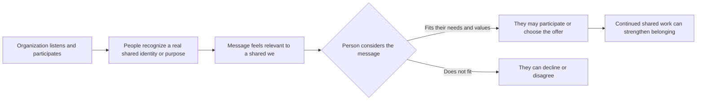

# Unity

## What it is

Unity is Robert Cialdini's principle that people can be more receptive to someone they experience as part of their “we”—someone who shares an identity or group membership that matters to them. It is the felt connection of being “one of us,” rather than simply seeing another person as likable or similar in a few ways. Cialdini describes Unity in the expanded edition of *Influence* as “the ‘we’ is the shared me.”

People belong to many overlapping groups: families, neighborhoods, schools, professions, cultural communities, teams, and groups formed around shared interests or experiences. Some identities are inherited or long-standing; others grow through participation, common work, values, or meaningful experiences. Which identity matters can change with the situation. Unity is a perception and relationship, not a label a marketer can assign to someone from the outside.

When people sense a genuine shared identity, they may listen with more trust, interpret a message as relevant to the group, cooperate, or give more weight to advice from another member. This can happen because communication feels less like a stranger's pitch and more like something that concerns “us.” It is a tendency, not a guarantee: group members disagree, and shared identity does not prove that a claim is true or a proposal is good.

Unity is not uniformity. No community thinks or behaves as one person. A shared identity can coexist with different histories, needs, opinions, and ways of expressing membership. Designers should make room for that variety rather than depicting a group as a stereotype.

## Unity and Liking

Liking can grow from familiarity, similarity, compliments, attractiveness, cooperation, or other positive feelings toward another person. Unity focuses more specifically on perceived shared identity and belonging: “we are part of the same group.” Someone might like a friendly stranger without feeling that they belong to the same community. Conversely, a person may feel a meaningful “we” with another member of their community without finding that person especially charming or attractive.

The ideas can overlap. Shared interests might make people like one another, and a shared identity might make a conversation warmer. The useful distinction is what the message relies on: personal positive feeling points toward Liking; an authentic sense of common membership points toward Unity.

## When to use it

Unity can be appropriate when a real, relevant connection helps people understand a message, participate, or make a decision together. It is useful to designers, educators, organizations, businesses, community groups, and people building relationships across a shared purpose. It can help welcome newcomers, communicate values, connect peers, support collaboration, and make an organization feel accountable to the people it serves.

Use Unity when an organization has earned the right to speak with a group through real participation, listening, shared work, or a clearly relevant membership. People should be free to decide whether an identity applies to them. The design can invite belonging; it cannot manufacture the relationship by announcing “we” on a page.

## How it works in different settings

- **Branding and marketing:** A local outdoor-clothing company co-designs a basic shirt with a community hiking group and identifies the group's actual role. Members may read the shirt as connected to a community they participate in, rather than as a generic item carrying a borrowed identity.
- **Websites:** A college's transfer-student page uses student-authored advice, names the experiences it addresses, and gives visitors ways to contribute. The page communicates “people who have navigated this path can help one another” through actual participation.
- **Social media:** A neighborhood mutual-aid group shares a post written with residents about a real shared project. Residents can recognize their own work and language in it; the connection comes from common activity, not a brand using neighborhood slang as a costume.
- **Education:** A teacher frames a class project around the shared task of making campus information easier for first-year students to use. Students with different backgrounds can contribute to the common goal without being told they all learn or think alike.
- **Networking:** An alumni gathering makes space for graduates from different years and fields to exchange advice. The alumni identity offers a point of connection, while each person remains an individual with distinct experience.
- **Organizations:** A workplace explains how staff members across roles contribute to a shared public purpose and invites them to shape the process. “We” is credible when people have a real voice and the organization's actions match the stated values.
- **Community building:** A library invites residents to help choose the topics and format of a public workshop. Shared participation can help people feel the program belongs to the community because the community helped make it.

## How design can communicate belonging

Visual choices can make a real shared identity easier to recognize. They should reflect the community's own meanings and include the range of people who participate.

- **Imagery:** Show consenting participants in real settings and varied roles. A photo of several actual volunteers working together can communicate shared effort; a generic image selected to stand in for an entire ethnicity or neighborhood reduces people to a visual shorthand.
- **Color:** Use colors that have a genuine connection to the organization or community, and check what they mean in context. A palette can create continuity across community materials, but color alone cannot prove membership or shared values.
- **Typography:** Choose type that supports the group's voice and remains readable. A community-authored headline can feel recognizable; imitating a cultural script or style without context may turn identity into decoration.
- **Layout:** Give participant voices and contributions visible space. A page that lets community members shape content communicates participation more clearly than a brand page that only displays a “community” badge.
- **Symbols:** Use marks, places, objects, or patterns only when their relevance is real and their use is welcome. Ask the people connected to a symbol how it should be represented.
- **Wording:** Use specific, accurate language about shared experience and purpose. “Built with students who commute to campus” is more grounded than “made for people like you” when the latter is based on an assumption.

Authentic representation, common experiences, common interests, participation, and shared values can all help people recognize a connection. The strongest signal is often the organization's conduct: who gets to participate, whose perspectives shape decisions, and whether the stated values show up in practice.

## One plain white T-shirt, several Unity frames

The physical product stays exactly the same: a plain white T-shirt. Its fabric, cut, fit, and construction do not change. What changes is the genuine group or shared purpose connected to it.

1. **A real community:** A neighborhood garden group chooses the plain shirt as an optional work shirt for volunteers. The group plans the event and the brand supplies the unchanged shirt. A volunteer might interpret wearing it as participation in a shared local project, because the connection comes from doing the work together.
2. **A shared interest:** A campus birdwatching club uses a plain white T-shirt as a neutral layer for field outings. The club's page pairs it with a checklist created by members. The shirt becomes associated with a real shared interest, although it remains a basic garment and not proof that the wearer is an expert birder.
3. **A shared experience:** First-year students who commute organize a welcome table and wear the same blank shirt so visitors can identify the volunteers. The shirt signals that these students are participating in a common welcome effort. It does not imply every commuter has the same story.
4. **A common value:** A clothing seller offers the same shirt as part of a repair-and-reuse workshop organized with local menders. The message emphasizes caring for clothing and sharing practical skills. Unity can come from a value participants enact together; the shirt itself is not automatically sustainable or ethically made because of that framing.
5. **A group identity:** A university's design club adopts the shirt for its annual open studio, after its members choose the garment and decide how to present it. Participants may see it as a marker of their shared club membership. Visitors should still be welcome if they do not own or wear one.

Each example gives the same object a context connected to a real group, experience, interest, or value. The frame can affect what the shirt means to someone; it should never be used to imply that buying it makes someone a member, or that a group endorses it when it does not.

## A Unity interaction

Unity may shape how a message is received, but people still assess its content and decide for themselves.

## Real-world examples

- **A volunteer organization formed after a flood:** If affected residents help plan recovery priorities alongside volunteers, and the organization gives residents decision-making roles, the shared experience and work can create a genuine “we.” This demonstrates Unity because the relationship is based on participation in a common effort. It would be misleading for an outside organization to claim “we survivors” without sharing that experience or giving affected people meaningful authority.
- **A professional association's peer mentoring:** A newer member may be more willing to ask for help from someone who shares the same profession and association. The professional identity and membership create a relevant common group, which can make advice feel connected to shared practice. The mentor should still be clear about limits and should not assume members have identical goals.
- **A campus cultural center event planned with students:** When students help decide the program, speakers, and access needs, attendees can see that the center reflects actual community participation. This is Unity because people help shape a space connected to a shared identity. One event still cannot represent every person who shares that identity.

These examples describe how Unity can operate; they are not claims about a specific named organization or measured outcome.

## Genuine Unity and counterfeit belonging

| Genuine Unity | Fake, exclusionary, or manipulative Unity |
| --- | --- |
| Builds on a real shared identity, experience, interest, purpose, or membership. | Claims “we are the same” based on a guess, demographic label, or marketing profile. |
| Lets participants influence the community and how it is represented. | Uses a community's symbols, stories, or style without its participation or permission. |
| Welcomes different perspectives and allows people to disagree. | Demands conformity or treats criticism as betrayal. |
| Describes who is included and leaves room for overlapping identities. | Draws arbitrary boundaries or implies that outsiders are inferior, dangerous, or unwelcome. |
| Uses shared values to guide real organizational behavior. | Uses value language as a sales costume while acting against those values. |
| Makes participation voluntary and the offer understandable on its own merits. | Suggests that a purchase, donation, vote, or disclosure proves loyalty or membership. |
| Represents people with consent and nuance. | Stereotypes a group or presents one person as representative of everyone. |

## When Unity may be ineffective, inappropriate, or unethical

Unity may not matter to an audience, may be outweighed by practical concerns, or may feel forced if the organization has not built a real relationship. A shared identity does not guarantee trust, agreement, expertise, or good judgment. People can disagree with members of their own group, and identities can be private, complicated, or irrelevant to a particular decision.

Unity is inappropriate when someone falsely claims membership or shared experience, exploits sensitive identity information, or uses belonging to pressure someone into a choice. Avoid implying that a person must buy, disclose personal information, join a group, or publicly endorse an organization to prove that they belong. In education, employment, healthcare, and public services, authority differences can make exclusion especially consequential.

An “us versus them” frame may create unnecessary hostility, hide the real issue, or suggest that people outside the group deserve less respect. Criticize harmful actions or policies specifically; do not turn disagreement into a claim that an entire out-group is bad. Never use stereotypes as a shortcut to define who “we” are. Ask the people represented, include meaningful ways to correct the portrayal, and let individuals describe their own relationship to a group.

## Questions for a designer

- What real identity, experience, interest, value, or membership connects the people in this message?
- Who says that connection matters, and have the people represented had a voice in the design?
- Am I inviting a person to recognize a connection, or assigning an identity to them?
- Does the organization participate in and uphold the shared purpose it claims?
- Can someone disagree, decline, or remain outside without being shamed or penalized?
- Does the message leave room for people within the group to differ?
- Are images, symbols, language, and stories accurate, contextual, and used with permission?
- Does the design rely on a stereotype or imply that one person speaks for an entire community?
- Am I creating an unnecessary enemy or dividing people into “us” and “them” to gain compliance?
- Can the audience judge the offer on its merits without proving loyalty or belonging?
- Would I describe the same connection honestly to members of the community being represented?

## Sources

- Robert B. Cialdini, *Influence, New and Expanded: The Psychology of Persuasion* (Harper Business, 2021), especially chapter 8, “Unity: The ‘We’ Is the Shared Me.” [Publisher edition details](https://www.harpercollins.com/products/influence-new-and-expanded-robert-b-cialdini).
- [Cialdini and Eberhardt on the Seven Principles of Influence](https://www.psychologicalscience.org/observer/universal-principles-of-influence), *Observer*, Association for Psychological Science. Interview discussing the principles and their ethical application.
- Greenaway, K. H., Wright, R. G., Willingham, J., Reynolds, K. J., and Haslam, S. A. “Shared Identity Is Key to Effective Communication.” *Personality and Social Psychology Bulletin* 41, no. 2 (2015): 171–182. [https://doi.org/10.1177/0146167214559709](https://doi.org/10.1177/0146167214559709). Two experiments on shared social identity and communication effectiveness.
- Haslam, S. Alexander, Stephen D. Reicher, and Michael J. Platow. *The New Psychology of Leadership: Identity, Influence and Power*, 2nd ed. Psychology Press, 2020. A research-based account of shared identity, leadership, and group influence.

## Navigation

[← Principles of Persuasion topic index](READ.ME.md)

## What You Should Remember

Unity is the feeling that another person or organization belongs to a meaningful “we.” Shared identity can make communication feel more relevant and support belonging, cooperation, and participation. Build that connection through real shared work and respect for differences; never invent membership, stereotype a group, or use belonging to pressure people.
